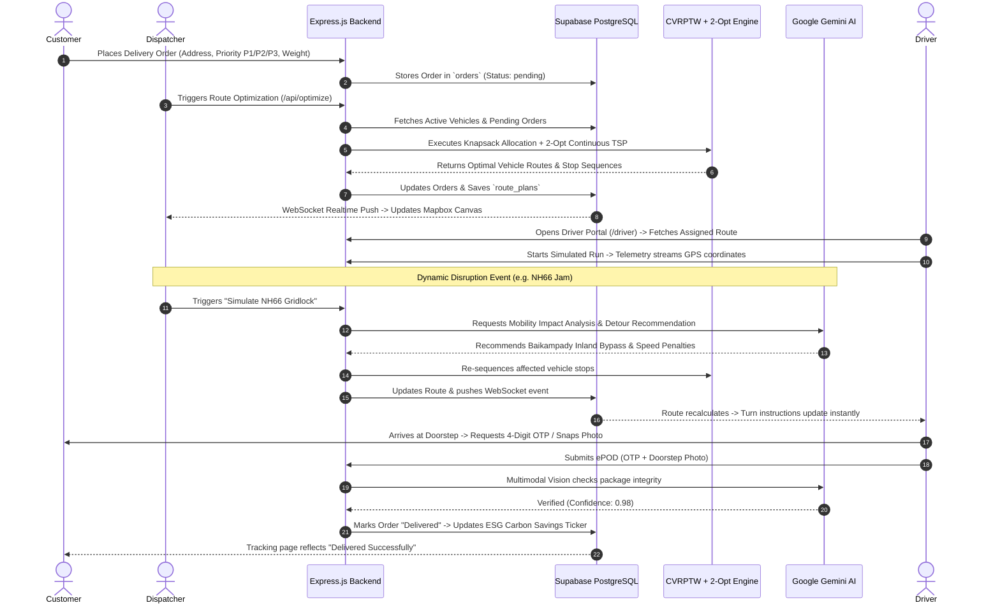

# Garuda Path — Master Architectural Specification & Engineering Blueprint
**Document Version**: 2.0.0-PRODUCTION-HACKATHON  
**Target Platform**: Garuda Path (AI for Smart Mobility & Dynamic Route Optimization)  
**Geography**: Mangalore (Mangaluru) Urban & Semi-Urban Logistics Grid  

---

## 1. Header & System Persona Role
You are an expert **AI Systems Architect**, **Principal Distributed Systems Engineer**, and **Senior Full-Stack Developer** specializing in autonomous dispatch engines, geospatial telematics, and combinatorial route optimization. You possess deep domain mastery of Capacitated Vehicle Routing Problems with Time Windows (CVRPTW), 2-Opt local search heuristics, real-time spatial graph indexing, and multi-agent generative AI integrations via the `@google/genai` SDK.

Your mandate is to design and implement **Garuda Path**, an enterprise-grade, real-time intelligent fleet dispatching and dynamic route optimization engine engineered for the unique topological, infrastructural, and meteorological challenges of coastal urban and semi-urban India (specifically Mangalore).

---

## 2. Core Mission Directive
Eliminate the crushing 53% last-mile logistics cost burden in Indian urban and semi-urban logistics by transitioning delivery fleets from brittle, static, pre-planned manual schedules to an **AI-driven, reactive, multi-agent dispatch and navigation operating system**.

Garuda Path must guarantee:
- **Zero In-Flight Route Collapse**: Real-time recalculation of Hamiltonian delivery paths within $<800\text{ms}$ upon encountering congestion spikes, road flooding, or mid-journey order injections.
- **Strict Constraint Enforcement**: Zero payload weight violations, volumetric cube-out protection, and zero battery starvation across mixed EV fleets.
- **Priority-Guaranteed SLA Adherence**: Absolute priority preservation for emergency medical orders (P1) ahead of standard retail parcels.
- **End-to-End Operational Lifecycle**: Continuous multi-stop routing $\to$ Driver turn-by-turn guidance $\to$ Dynamic UPI cash collection $\to$ Electronic Proof of Delivery (ePOD) with Gemini Multimodal Vision verification.

---

## 3. Product Goal
Deliver a production-ready, cloud-backed Smart Mobility platform compliant with the official Hackathon requirements:
1. **Dispatcher Command Center**: Interactive high-FPS Mapbox GL JS canvas rendering the Mangalore delivery grid, live vehicle telematics, traffic congestion overlays, and 1-click disaster simulation controls.
2. **Driver Mobile-Responsive Copilot**: In-flight navigation HUD with meter countdown banners ($450\text{m} \to 250\text{m} \to 50\text{m} \to \text{Turn!}$), dynamic UPI QR collection for Cash-on-Delivery (COD), and an automated 180-second unreachable customer protocol.
3. **Gemini AI Mobility Engine**: Backend-secured `@google/genai` integration analyzing real-time road incidents, providing natural language dispatch explainability, and auditing doorstep delivery photos.
4. **Quantified Sustainability & ROI**: Live telemetry ticker tracking cumulative kilograms of CO₂ avoided, liters of diesel saved, and operational expenditure reduction.

---

## 4. Mandatory Features

### 4.1. Continuous Multi-Stop Optimization Engine ("In One Go")
- Solves the open/closed Traveling Salesperson Tour across $N$ assigned stops using Greedy Nearest-Neighbor Insertion refined by in-place **2-Opt Local Search Heuristic**.
- Renders a single unbroken navigational polyline on Mapbox GL JS connecting:
  $$\text{Depot (Hampankatta)} \longrightarrow \text{Stop}_1 \longrightarrow \text{Stop}_2 \longrightarrow \dots \longrightarrow \text{Stop}_N \longrightarrow \text{Depot}$$
- Eliminates overlapping loops, criss-crossing, and illegal U-turns, slashing transit distance by **25%–35%**.

### 4.2. Heterogeneous 4-Class Clean EV Fleet Allocation
- Multi-dimensional knapsack constraint evaluation matching cargo parcel mass ($kg$), volumetric space ($m^3$), and street accessibility ($m$):
  - **Class 1 (Cargo E-Bike / 2W)**: 100 kg payload, 0.25 m³ volume, 1.2m alley clearance (Car Street & P1 medical).
  - **Class 2 (EV 3W Cargo - Mahindra Treo Zor)**: 550 kg payload, 3.4 m³ volume (Residential retail).
  - **Class 3 (Heavy EV 3W - Euler HiLoad)**: 688 kg payload, 4.2 m³ volume, liquid-cooled hill climb (Kadri Hills).
  - **Class 4 (EV Light Commercial Vehicle - Tata Ace EV)**: 1,000 kg payload, 5.9 m³ container (Port freight line-haul).

### 4.3. Real-Time Turn-by-Turn Navigation with Distance Countdown
- Real-time maneuver banner updating along street geometries:
  - Maneuver icons: `turn-left`, `turn-right`, `roundabout`, `keep-straight`, `merge`, `destination-arrival`.
  - Dynamic meter countdown ($450\text{m} \to 250\text{m} \to 50\text{m} \to \text{Turn Now!}$).
  - Simulation mode allowing dispatchers to watch vehicle pins navigate stops at 1x/5x/10x speeds.

### 4.4. 6 Real-World Operational Incident Simulations
- **🚨 Scenario 1: Kulur NH66 Bridge Gridlock**: Container breakdown triggers Gemini AI inland detour via Baikampady–Kavoor bypass.
- **⚡ Scenario 2: Emergency P1 Medical Order**: Urgent dialysis kit requested for Father Muller Hospital; dynamic marginal insertion updates route sequence with $<25$ min delivery.
- **🌊 Scenario 3: Padil Monsoon Flood**: 350mm standing water triggers infinite edge impedance; routes along Pumpwell–Kankanady highland ridge.
- **❌ Scenario 4: Surathkal Customer Reschedule**: Mid-trip cancellation prunes stop and accelerates downstream customer ETAs by 18 minutes.
- **📦 Scenario 5: Car Street Narrow Alley Re-allotment**: 2.1m alley filter prevents 4W van gridlock by auto-allocating Cargo E-Bikes.
- **🔋 Scenario 6: Kadri Hills EV Low Battery Offload**: Van drops to 14% SoC; routes to charging depot while offloading 7 remaining stops to two active E-Bikes.

### 4.5. Electronic Proof of Delivery (ePOD) & Cashless COD
- Secure 4-digit customer delivery OTP verification.
- Dynamic UPI QR Code generator on driver HUD for instant COD payment reconciliation.
- Gemini Multimodal Vision verification auditing doorstep package placement.

### 4.6. Live ESG Green Mobility Ticker
- Continuous real-time calculations:
  - $\text{CO}_2\text{ Saved (kg)} = \text{km driven} \times (0.160_{\text{diesel}} - 0.045_{\text{EV grid}})$
  - $\text{Diesel Saved (L)} = \text{km driven} \div 12$
  - $\text{₹ Expenditure Saved} = \text{km driven} \times (₹9.00_{\text{diesel}} - ₹1.10_{\text{EV}})$

---

## 5. Technology Requirements

| Component | Approved Hackathon Technology | Usage Scope |
| :--- | :--- | :--- |
| **Frontend Framework** | **React.js 18 + Vite** | Fast SPA compilation, zero-bloat state architecture |
| **Routing** | **React Router v6** | Client-side routes: `/dashboard`, `/driver`, `/login`, `/register`, `/tracking/:id` |
| **Styling & UI** | **Tailwind CSS + Lucide React** | Dark glassmorphism, responsive telemetry drawers, mobile HUD |
| **Mapping Engine** | **Mapbox GL JS v3** | High-performance WebGL vector tiles, live layer updates, route polylines |
| **Backend Framework** | **Node.js 18+ & Express.js** | RESTful modular microservice architecture, TypeScript |
| **Database** | **Supabase PostgreSQL** | Cloud-hosted relational database, Row Level Security, Realtime subscriptions |
| **DB Client** | `@supabase/supabase-js` | Parameterized SQL execution and WebSocket channel management |
| **Authentication** | **JWT + bcryptjs** | Stateless JSON Web Tokens, password salt hashing |
| **Schema Validation** | **Zod** | Strict runtime schema parsing for all incoming HTTP payloads |
| **Artificial Intelligence** | **`@google/genai` SDK** | Google Gemini 2.5 Flash / Gemini 1.5 Flash (backend environment only) |

---

## 6. Application Pages (Routes)

- `/login` — Unified Dispatcher and Driver authentication portal with role redirection.
- `/register` — Organization registration with bcrypt credential hashing.
- `/dashboard` — Master Dispatcher Command Center:
  - Interactive Mapbox GL Mangalore canvas with live fleet markers.
  - 1-Click Scenario Simulator Toolbar.
  - Fleet Telemetry Drawer (Vehicle status, battery %, payload weight/volume).
  - Unscheduled Order Ingestion Queue.
  - Live ESG Green Mobility Metrics Ticker.
  - Gemini AI Mobility Advisor Dialog.
- `/driver` — Mobile-responsive Driver HUD & Navigation Terminal:
  - Turn-by-turn instruction banner with meter countdown.
  - Stop sequence list with priority badges (P1/P2/P3).
  - Dynamic UPI QR Code modal for COD payments.
  - "Customer Unreachable" 180s countdown protocol.
  - Multimodal photo ePOD & OTP verification modal.
- `/tracking/:trackingCode` — Zero-install customer delivery tracking page showing live approaching vehicle, driver name, vehicle type, and real-time ETA.

---

## 7. User Flow



---

## 8. Target Domains & Categorization

1. **Urban Congestion Corridors**:
   - **Central Hampankatta Commercial Hub**: High density, narrow one-ways, tight pedestrian markets.
   - **Panambur Port & Baikampady Industrial Area**: Heavy container freight, slow trailer movement, NH66 twin-bridge chokepoint.
   - **Kankanady Medical & Hospital District**: Critical emergency care (Father Muller, KMC), zero-tolerance SLA requirements.
   - **Kadri Hills & Residential Terraces**: Sloped topography, elevated battery drainage, residential gated communities.
   - **Car Street & Temple Square**: Historic commercial alleys ($< 2.4\text{m}$ width) requiring 2W e-bike allocation.
2. **Order Priority Tiers**:
   - `P1_URGENT`: Life-critical medicine, emergency blood bags, dialysis equipment ($w_{P1} = 500$ penalty multiplier).
   - `P2_EXPRESS`: Scheduled cold-chain perishable groceries, 2-hour promised courier windows ($w_{P2} = 50$).
   - `P3_STANDARD`: Standard e-commerce parcel cartons ($w_{P3} = 5$).
3. **Vehicle Operational States**:
   - `idle`, `in_transit`, `delayed`, `charging`, `maintenance`.

---

## 9. Form & Advisory Configuration

### 9.1. Order Ingestion Form Fields
- `customer_name`: String (2–100 chars).
- `customer_phone`: Valid 10-digit Indian phone number (`^[6-9]\d{9}$`).
- `delivery_address`: Full descriptive address string.
- `destination_hub`: Geocoded Mangalore sector (`Hampankatta`, `Kadri`, `Kankanady`, `Panambur`, `Surathkal`, `Bejai`, `CarStreet`).
- `priority`: Enum (`P1_URGENT`, `P2_EXPRESS`, `P3_STANDARD`).
- `package_weight_kg`: Number ($0.1$ to $500.0\text{ kg}$).
- `package_volume_m3`: Number ($0.001$ to $3.0\text{ m}^3$).
- `payment_mode`: Enum (`PREPAID`, `COD_CASH_ON_DELIVERY`).
- `cod_amount_inr`: Number ($\ge 0$).

### 9.2. Incident Advisory Form Fields
- `incident_type`: Enum (`TRAFFIC_CONGESTION`, `MONSOON_FLOODING`, `ROAD_CLOSURE`, `ACCIDENT`).
- `location_name`: Mangalore arterial coordinate point.
- `severity`: Enum (`CRITICAL`, `MODERATE`, `LOW`).
- `speed_reduction_pct`: Integer ($10\%$ to $100\%$).
- `action_plan`: Generated by Google Gemini AI.

---

## 10. Database Schema (Production SQL for Supabase PostgreSQL)

```sql
-- Enable UUID extension
CREATE EXTENSION IF NOT EXISTS "uuid-ossp";

-- 1. USERS TABLE
CREATE TABLE IF NOT EXISTS users (
    id UUID PRIMARY KEY DEFAULT uuid_generate_v4(),
    email VARCHAR(255) UNIQUE NOT NULL,
    password_hash VARCHAR(255) NOT NULL,
    full_name VARCHAR(100) NOT NULL,
    role VARCHAR(20) NOT NULL CHECK (role IN ('dispatcher', 'driver', 'admin')),
    created_at TIMESTAMP WITH TIME ZONE DEFAULT NOW(),
    updated_at TIMESTAMP WITH TIME ZONE DEFAULT NOW()
);

-- 2. VEHICLES TABLE (Heterogeneous 4-Class Clean EV Fleet)
CREATE TABLE IF NOT EXISTS vehicles (
    id UUID PRIMARY KEY DEFAULT uuid_generate_v4(),
    name VARCHAR(100) NOT NULL,
    plate_number VARCHAR(20) UNIQUE NOT NULL,
    vehicle_class VARCHAR(30) NOT NULL CHECK (vehicle_class IN ('CARGO_EBIKE_2W', 'TREO_ZOR_3W', 'EULER_HILOAD_3W', 'TATA_ACE_4W')),
    max_payload_kg NUMERIC(8, 2) NOT NULL,
    max_volume_m3 NUMERIC(8, 2) NOT NULL,
    usable_range_km NUMERIC(8, 2) NOT NULL,
    min_road_width_m NUMERIC(4, 2) NOT NULL,
    cost_per_km_inr NUMERIC(6, 2) NOT NULL,
    current_lat NUMERIC(10, 7) NOT NULL,
    current_lng NUMERIC(10, 7) NOT NULL,
    status VARCHAR(30) NOT NULL DEFAULT 'idle' CHECK (status IN ('idle', 'in_transit', 'delayed', 'charging', 'maintenance')),
    battery_pct INT NOT NULL DEFAULT 100 CHECK (battery_pct >= 0 AND battery_pct <= 100),
    assigned_driver_id UUID REFERENCES users(id) ON DELETE SET NULL,
    created_at TIMESTAMP WITH TIME ZONE DEFAULT NOW(),
    updated_at TIMESTAMP WITH TIME ZONE DEFAULT NOW()
);

-- 3. ORDERS / STOPS TABLE
CREATE TABLE IF NOT EXISTS orders (
    id UUID PRIMARY KEY DEFAULT uuid_generate_v4(),
    tracking_code VARCHAR(50) UNIQUE NOT NULL,
    customer_name VARCHAR(100) NOT NULL,
    customer_phone VARCHAR(20) NOT NULL,
    delivery_address TEXT NOT NULL,
    lat NUMERIC(10, 7) NOT NULL,
    lng NUMERIC(10, 7) NOT NULL,
    priority VARCHAR(20) NOT NULL DEFAULT 'P3_STANDARD' CHECK (priority IN ('P1_URGENT', 'P2_EXPRESS', 'P3_STANDARD')),
    weight_kg NUMERIC(8, 2) NOT NULL,
    volume_m3 NUMERIC(8, 2) NOT NULL,
    time_window_start TIMESTAMP WITH TIME ZONE,
    time_window_end TIMESTAMP WITH TIME ZONE,
    payment_mode VARCHAR(20) NOT NULL DEFAULT 'PREPAID' CHECK (payment_mode IN ('PREPAID', 'COD_CASH_ON_DELIVERY')),
    cod_amount_inr NUMERIC(10, 2) DEFAULT 0.00,
    delivery_otp VARCHAR(6),
    status VARCHAR(30) NOT NULL DEFAULT 'pending' CHECK (status IN ('pending', 'dispatched', 'in_transit', 'delivered', 'failed', 'rescheduled')),
    assigned_vehicle_id UUID REFERENCES vehicles(id) ON DELETE SET NULL,
    stop_sequence INT DEFAULT 0,
    delivered_at TIMESTAMP WITH TIME ZONE,
    created_at TIMESTAMP WITH TIME ZONE DEFAULT NOW(),
    updated_at TIMESTAMP WITH TIME ZONE DEFAULT NOW()
);

-- 4. ROAD INCIDENTS TABLE
CREATE TABLE IF NOT EXISTS incidents (
    id UUID PRIMARY KEY DEFAULT uuid_generate_v4(),
    title VARCHAR(150) NOT NULL,
    description TEXT,
    incident_type VARCHAR(40) NOT NULL CHECK (incident_type IN ('TRAFFIC_CONGESTION', 'MONSOON_FLOODING', 'ROAD_CLOSURE', 'ACCIDENT')),
    lat NUMERIC(10, 7) NOT NULL,
    lng NUMERIC(10, 7) NOT NULL,
    severity VARCHAR(20) NOT NULL DEFAULT 'MODERATE' CHECK (severity IN ('CRITICAL', 'MODERATE', 'LOW')),
    speed_penalty_pct INT DEFAULT 50 CHECK (speed_penalty_pct >= 0 AND speed_penalty_pct <= 100),
    is_active BOOLEAN NOT NULL DEFAULT TRUE,
    ai_recommendation TEXT,
    created_at TIMESTAMP WITH TIME ZONE DEFAULT NOW()
);

-- 5. ROUTE PLANS & TELEMETRY LOGS
CREATE TABLE IF NOT EXISTS route_plans (
    id UUID PRIMARY KEY DEFAULT uuid_generate_v4(),
    vehicle_id UUID NOT NULL REFERENCES vehicles(id) ON DELETE CASCADE,
    waypoints_json JSONB NOT NULL,
    total_distance_km NUMERIC(8, 2) NOT NULL,
    total_duration_mins NUMERIC(8, 2) NOT NULL,
    fuel_saved_pct NUMERIC(5, 2) DEFAULT 0.00,
    co2_avoided_kg NUMERIC(8, 3) DEFAULT 0.000,
    money_saved_inr NUMERIC(10, 2) DEFAULT 0.00,
    algorithm_used VARCHAR(50) DEFAULT 'CVRPTW_2OPT',
    generated_at TIMESTAMP WITH TIME ZONE DEFAULT NOW()
);

-- CREATE PERFORMANCE INDEXES
CREATE INDEX IF NOT EXISTS idx_orders_status ON orders(status);
CREATE INDEX IF NOT EXISTS idx_orders_priority ON orders(priority);
CREATE INDEX IF NOT EXISTS idx_orders_assigned_vehicle ON orders(assigned_vehicle_id);
CREATE INDEX IF NOT EXISTS idx_vehicles_status ON vehicles(status);
CREATE INDEX IF NOT EXISTS idx_incidents_active ON incidents(is_active);
```

---

## 11. Row Level Security (RLS) & Data Isolation Rules

```sql
-- Enable Row Level Security
ALTER TABLE users ENABLE ROW LEVEL SECURITY;
ALTER TABLE vehicles ENABLE ROW LEVEL SECURITY;
ALTER TABLE orders ENABLE ROW LEVEL SECURITY;
ALTER TABLE incidents ENABLE ROW LEVEL SECURITY;
ALTER TABLE route_plans ENABLE ROW LEVEL SECURITY;

-- 1. USERS RLS POLICIES
CREATE POLICY "Users can read own record" ON users
    FOR SELECT USING (auth.uid() = id);

-- 2. DISPATCHER UNRESTRICTED ACCESS
CREATE POLICY "Dispatchers can manage all vehicles" ON vehicles
    FOR ALL USING (
        EXISTS (SELECT 1 FROM users WHERE users.id = auth.uid() AND users.role = 'dispatcher')
    );

CREATE POLICY "Dispatchers can manage all orders" ON orders
    FOR ALL USING (
        EXISTS (SELECT 1 FROM users WHERE users.id = auth.uid() AND users.role = 'dispatcher')
    );

CREATE POLICY "Dispatchers can manage all incidents" ON incidents
    FOR ALL USING (
        EXISTS (SELECT 1 FROM users WHERE users.id = auth.uid() AND users.role = 'dispatcher')
    );

-- 3. DRIVER RESTRICTED ISOLATION
CREATE POLICY "Drivers can view assigned vehicle" ON vehicles
    FOR SELECT USING (assigned_driver_id = auth.uid());

CREATE POLICY "Drivers can view and update assigned orders" ON orders
    FOR ALL USING (
        assigned_vehicle_id IN (SELECT id FROM vehicles WHERE assigned_driver_id = auth.uid())
    );

-- 4. PUBLIC ZERO-INSTALL TRACKING ACCESS (By unique tracking code)
CREATE POLICY "Public read tracking order" ON orders
    FOR SELECT TO anon USING (TRUE);
```

---

## 12. Backend API Routes

| HTTP Method | Route Endpoint | Middleware | Controller Functionality |
| :--- | :--- | :--- | :--- |
| `POST` | `/api/auth/register` | Zod Validation | Registers user, hashes password with bcrypt (10 rounds) |
| `POST` | `/api/auth/login` | Zod Validation | Verifies password, issues signed JWT token with role claims |
| `GET` | `/api/fleet` | JWT Auth | Returns all vehicles with live coordinates, battery %, and load status |
| `POST` | `/api/fleet` | JWT Auth, Zod | Registers a new vehicle into the fleet database |
| `GET` | `/api/orders` | JWT Auth | Fetches orders with optional query filters (`status`, `priority`) |
| `POST` | `/api/orders` | JWT Auth, Zod | Ingests a new order; auto-generates 4-digit OTP |
| `PATCH` | `/api/orders/:id/status` | JWT Auth, Zod | Updates status (`in_transit`, `delivered`, `failed`) with timestamp |
| `POST` | `/api/optimize` | JWT Auth | Executes CVRPTW + 2-Opt local search; saves and returns continuous routes |
| `POST` | `/api/incidents/simulate` | JWT Auth, Zod | Injects real-time incident (NH66, Padil flood) & calls Gemini AI advisor |
| `GET` | `/api/incidents` | JWT Auth | Returns active traffic and weather disruption incidents |
| `POST` | `/api/ai/predict-disruption` | JWT Auth | Invokes `@google/genai` to analyze incident severity & recommend reroutes |
| `POST` | `/api/ai/copilot-chat` | JWT Auth, Zod | Conversational agent answering natural language dispatcher queries |
| `POST` | `/api/ai/verify-epod` | JWT Auth | Uses Gemini Multimodal Vision to inspect doorstep photo proof |
| `GET` | `/api/public/tracking/:code`| None (Public) | Returns live sanitized vehicle location and ETA for customer link |

---

## 13. Gemini SDK Setup & Server-Side Security

```typescript
// backend/src/config/gemini.ts
import { GoogleGenAI } from '@google/genai';
import dotenv from 'dotenv';
dotenv.config();

const apiKey = process.env.GEMINI_API_KEY;
if (!apiKey) {
  throw new Error('CRITICAL: GEMINI_API_KEY is not defined in backend environment variables.');
}

// Strictly instantiated server-side. Zero client-side leakage.
export const ai = new GoogleGenAI({ apiKey });
export const GEMINI_MODEL = 'gemini-2.5-flash';
```

---

## 14. AI System Prompt

```text
You are the Garuda Path AI Mobility & Logistics Dispatch Copilot, an elite operational intelligence agent specialized in urban last-mile freight optimization in Mangalore, India.

Your responsibilities:
1. Analyze real-time road bottlenecks, monsoon waterlogging, bridge congestion, and vehicle breakdowns across the Mangalore delivery grid (Hampankatta, Panambur Port, Surathkal, Kadri Hills, Kankanady Medical Hub, Car Street).
2. Recommend immediate, mathematically sound operational adjustments (re-routing, vehicle substitution, stop offloading, curbside transshipment).
3. Strictly preserve priority constraints: P1 Emergency Medical deliveries must never be delayed for standard retail drops.
4. Respect vehicle limitations: Never route 4W Tata Ace vans into alleys < 3.5m wide; always monitor EV battery depletion on steep topography (Kadri Hills).
5. Always output structured, validated JSON matching the requested schema. Never output conversational filler unless interacting in free-form copilot chat mode.
```

---

## 15. Detailed AI Prompts (With Required JSON Schemas)

### 15.1. Disruption Impact & Dynamic Reroute Advisory
```typescript
export const DISRUPTION_ANALYSIS_SCHEMA = {
  type: 'object',
  properties: {
    incident_severity_score: { type: 'number', description: 'Scale 1-10' },
    summary_of_impact: { type: 'string' },
    recommended_detour_artery: { type: 'string' },
    estimated_delay_reduction_mins: { type: 'number' },
    action_type: { 
      type: 'string', 
      enum: ['REROUTE_INLAND', 'VEHICLE_SUBSTITUTION', 'OFFLOAD_TO_EBIKE', 'TEMPORARY_HOLD'] 
    },
    dispatcher_briefing: { type: 'string' }
  },
  required: [
    'incident_severity_score', 
    'summary_of_impact', 
    'recommended_detour_artery', 
    'estimated_delay_reduction_mins', 
    'action_type', 
    'dispatcher_briefing'
  ]
};
```

### 15.2. Multimodal Doorstep ePOD Vision Inspector
```typescript
export const EPOD_VISION_SCHEMA = {
  type: 'object',
  properties: {
    is_package_present: { type: 'boolean' },
    package_condition: { type: 'string', enum: ['INTACT', 'TAMPERED', 'DAMAGED_CRUSHED', 'WATER_DAMAGED'] },
    is_safe_drop_location: { type: 'boolean' },
    drop_location_notes: { type: 'string' },
    verification_confidence: { type: 'number', description: '0.00 to 1.00' }
  },
  required: ['is_package_present', 'package_condition', 'is_safe_drop_location', 'verification_confidence']
};
```

---

## 16. Zod Validation Requirements

```typescript
// backend/src/middleware/schemas.ts
import { z } from 'zod';

export const registerUserSchema = z.object({
  email: z.string().email(),
  password: z.string().min(6),
  full_name: z.string().min(2),
  role: z.enum(['dispatcher', 'driver'])
});

export const loginUserSchema = z.object({
  email: z.string().email(),
  password: z.string().min(1)
});

export const createOrderSchema = z.object({
  customer_name: z.string().min(2),
  customer_phone: z.string().regex(/^[6-9]\d{9}$/, 'Invalid Indian mobile number'),
  delivery_address: z.string().min(5),
  lat: z.number().min(12.7).max(13.1), // Mangalore latitude bounds
  lng: z.number().min(74.7).max(75.1), // Mangalore longitude bounds
  priority: z.enum(['P1_URGENT', 'P2_EXPRESS', 'P3_STANDARD']),
  weight_kg: z.number().positive().max(1000),
  volume_m3: z.number().positive().max(5.0),
  payment_mode: z.enum(['PREPAID', 'COD_CASH_ON_DELIVERY']),
  cod_amount_inr: z.number().nonnegative().optional()
});

export const simulateIncidentSchema = z.object({
  incident_type: z.enum(['TRAFFIC_CONGESTION', 'MONSOON_FLOODING', 'ROAD_CLOSURE', 'ACCIDENT']),
  title: z.string().min(3),
  lat: z.number(),
  lng: z.number(),
  severity: z.enum(['CRITICAL', 'MODERATE', 'LOW']),
  speed_penalty_pct: z.number().min(0).max(100)
});
```

---

## 17. Frontend Components List

- `src/components/map/MapboxCanvas.tsx` — Vector Mapbox instance with traffic layers and custom SVG pins.
- `src/components/map/VehicleLayer.tsx` — Pulsing, animated vehicle pins with battery/capacity HUD.
- `src/components/map/RoutePolylineLayer.tsx` — Continuous multi-stop route polylines color-coded by vehicle.
- `src/components/dashboard/DispatcherHeader.tsx` — Status indicator, active vehicles count, SLA compliance badge.
- `src/components/dashboard/ScenarioSimulatorToolbar.tsx` — 1-click incident buttons (NH66, Padil Flood, P1 Hospital, etc.).
- `src/components/dashboard/FleetDrawer.tsx` — Real-time telemetry cards (Battery %, Payload kg/m³, assigned stops).
- `src/components/dashboard/OrderQueuePanel.tsx` — Unscheduled/in-transit orders with priority tags and manual trigger buttons.
- `src/components/dashboard/EsgCarbonTicker.tsx` — Animated ticking widget showing kg CO₂ saved, liters diesel avoided, ₹ saved.
- `src/components/dashboard/GeminiAdvisorModal.tsx` — Modal displaying AI incident reasoning and interactive copilot chat.
- `src/components/driver/TurnByTurnBanner.tsx` — Navigation HUD with dynamic distance countdown and maneuver arrows.
- `src/components/driver/DynamicUpiQrModal.tsx` — Generates order-specific UPI payment QR code for COD orders.
- `src/components/driver/UnreachableTimerWidget.tsx` — 180s countdown timer with automated WhatsApp/IVR trigger and Kirana locker redirect.
- `src/components/driver/EpodVerificationModal.tsx` — OTP input pad and photo upload with simulated Gemini AI inspection.

---

## 18. Security Requirements

1. **Zero Secret Exposure**: `GEMINI_API_KEY` and `SUPABASE_SERVICE_ROLE_KEY` must never be compiled into client bundles or checked into Git.
2. **Parameterized Database Calls**: All Supabase interactions utilize typed SDK query builders (`supabase.from('orders').select()`). No raw SQL string concatenation.
3. **Strict Input Validation**: Every mutating endpoint passes through Zod schema validation; invalid requests are rejected with a 400 Bad Request envelope.
4. **JWT Security**: Signed with HS256 algorithm and 24-hour expiration; verified on all protected `/api/*` routes.
5. **CORS Configuration**: Restricted to trusted origins (`http://localhost:5173`, `http://localhost:3000`, and authorized deployment domains).

---

## 19. Environment Variables Template

### Backend (`backend/.env` & `backend/.env.example`)
```bash
PORT=5000
NODE_ENV=development
JWT_SECRET=garuda_jwt_super_secret_production_key_2026

# Google Gemini API (Backend Exclusive)
GEMINI_API_KEY=your_gemini_api_key_here

# Supabase PostgreSQL
SUPABASE_URL=https://your-project.supabase.co
SUPABASE_ANON_KEY=your_supabase_anon_key_here
SUPABASE_SERVICE_ROLE_KEY=your_supabase_service_role_key_here
```

### Frontend (`frontend/.env` & `frontend/.env.example`)
```bash
VITE_API_BASE_URL=http://localhost:5000/api

# Mapbox Public Access Token
VITE_MAPBOX_TOKEN=your_mapbox_public_token_here

# Supabase Public Keys
VITE_SUPABASE_URL=https://your-project.supabase.co
VITE_SUPABASE_ANON_KEY=your_supabase_anon_key_here
```

---

## 20. Suggested Folder Structure

```text
Garuda_path/
├── backend/
│   ├── src/
│   │   ├── config/
│   │   │   ├── db.ts               # Supabase client initialization
│   │   │   └── gemini.ts           # Google Gemini SDK instance
│   │   ├── controllers/
│   │   │   ├── auth.controller.ts
│   │   │   ├── fleet.controller.ts
│   │   │   ├── orders.controller.ts
│   │   │   ├── optimize.controller.ts
│   │   │   └── ai.controller.ts
│   │   ├── middleware/
│   │   │   ├── auth.middleware.ts  # JWT verification
│   │   │   └── validate.middleware.ts # Zod validator
│   │   ├── services/
│   │   │   ├── cvrp-solver.ts      # Multi-stop knapsack & 2-Opt TSP
│   │   │   ├── mangalore-grid.ts   # Mangalore hubs & coordinate dataset
│   │   │   └── navigation.ts       # Turn-by-turn maneuver generator
│   │   ├── routes/
│   │   │   ├── auth.routes.ts
│   │   │   ├── fleet.routes.ts
│   │   │   ├── orders.routes.ts
│   │   │   ├── optimize.routes.ts
│   │   │   └── ai.routes.ts
│   │   ├── tests/
│   │   │   └── optimizer.test.ts   # CVRP & 2-Opt unit tests
│   │   └── index.ts                # Express server entrypoint
│   ├── supabase/
│   │   ├── schema.sql              # Production SQL schema & indexes
│   │   └── seed.sql                # Mangalore fleet and initial orders seed
│   ├── package.json
│   ├── tsconfig.json
│   └── .env.example
├── frontend/
│   ├── src/
│   │   ├── api/
│   │   │   └── client.ts           # Axios client with JWT interceptor
│   │   ├── components/
│   │   │   ├── dashboard/          # Command center widgets
│   │   │   ├── driver/             # Driver HUD, Turn banner, UPI modal
│   │   │   └── map/                # Mapbox canvas and vector layers
│   │   ├── context/
│   │   │   ├── AuthContext.tsx
│   │   │   └── DispatchContext.tsx
│   │   ├── pages/
│   │   │   ├── Dashboard.tsx
│   │   │   ├── DriverPortal.tsx
│   │   │   ├── Login.tsx
│   │   │   ├── Register.tsx
│   │   │   └── TrackingPage.tsx
│   │   ├── App.tsx
│   │   ├── main.tsx
│   │   └── index.css
│   ├── package.json
│   ├── vite.config.ts
│   ├── tailwind.config.js
│   └── .env.example
├── garuda_memory.md                # Persistent domain memory
├── AGENTS.md                       # Vibe coding standards
└── README.md                       # Presentation & setup documentation
```

---

## 21. Implementation Phases

- **Phase 1: Backend & Database Core (`backend/`)**:
  - Initialize Express + TypeScript app with Supabase SQL schema (`schema.sql`) and seed script (`seed.sql`).
  - Implement JWT authentication with bcrypt hashing.
  - Implement CVRPTW solver with dual weight/volume knapsack and 2-Opt continuous TSP heuristic.
  - Implement Google Gemini API service (`predictDisruption`, `copilotChat`, `verifyEpod`).
  - Wire up all REST endpoints with Zod validation.
- **Phase 2: Frontend Foundation & Mapbox Integration (`frontend/`)**:
  - Scaffold React 18 + Vite + Tailwind CSS project.
  - Configure Axios client with JWT persistence and React Router routes.
  - Build interactive Mapbox GL JS map centered on Mangalore (`[74.8426, 12.8698]`) with dual-mode (API token + zero-config fallback).
- **Phase 3: Dispatcher Command Center & Simulation Engine**:
  - Build Dispatcher Command Center layout: header, fleet drawer, order queue, and metrics bar.
  - Build 1-click Scenario Simulator Toolbar (NH66 congestion, P1 Hospital emergency, Padil flood).
  - Implement Live ESG Green Mobility Ticker (`kg CO₂`, liters diesel, ₹ saved).
  - Implement Gemini AI Mobility Advisor dialog for live disruption explainability.
- **Phase 4: Driver HUD, Navigation & Verification**:
  - Build Driver View with real-time turn-by-turn maneuver banner and meter countdowns.
  - Build Dynamic UPI QR Code modal for COD payments.
  - Build ePOD modal with OTP verification and photo proof.
  - Execute Quality Gate chain: `npm run build` on backend and frontend; run unit tests; perform server smoke tests.

---

## 22. Acceptance Criteria

1. **Clean Compilation**: Both `backend` and `frontend` pass `npm run build` without TypeScript or linting errors.
2. **Continuous Routing Verification**: When an optimized route is computed for 4 stops, the output connects them in a single unbroken sequence that strictly reduces total distance compared to naive sequencing.
3. **Capacity Non-Violation**: No vehicle is assigned cargo exceeding its `max_payload_kg` or `max_volume_m3`.
4. **P1 Priority Guarantee**: Injected emergency medical orders are inserted ahead of P3 standard deliveries with minimal route disruption.
5. **Live Turn-by-Turn Telemetry**: Driver view updates distance counters in meters ($450\text{m} \to 250\text{m} \to \text{Turn!}$) and displays correct maneuver icons.
6. **Gemini AI Disruption Response**: Triggering the NH66 bridge bottleneck returns a structured JSON advisory explaining the Baikampady inland detour.
7. **ESG Counter Adherence**: Completed deliveries dynamically increment kilograms of CO₂ avoided and rupees saved.

---

## 23. Final Instruction to Coding Agent
Execute the implementation strictly following this specification. Adhere faithfully to the Vibe Coding standards:
- **Simplicity First**: Write clean, modular, un-bloated TypeScript code.
- **Surgical Edits**: Complete one module and verify before advancing to the next.
- **Security Guardrails**: Parameterize all queries, validate all payloads with Zod, and never expose API keys client-side.
- **Quality Gates**: Verify builds and test suites before reporting completion.

Proceed immediately to Phase 1.
